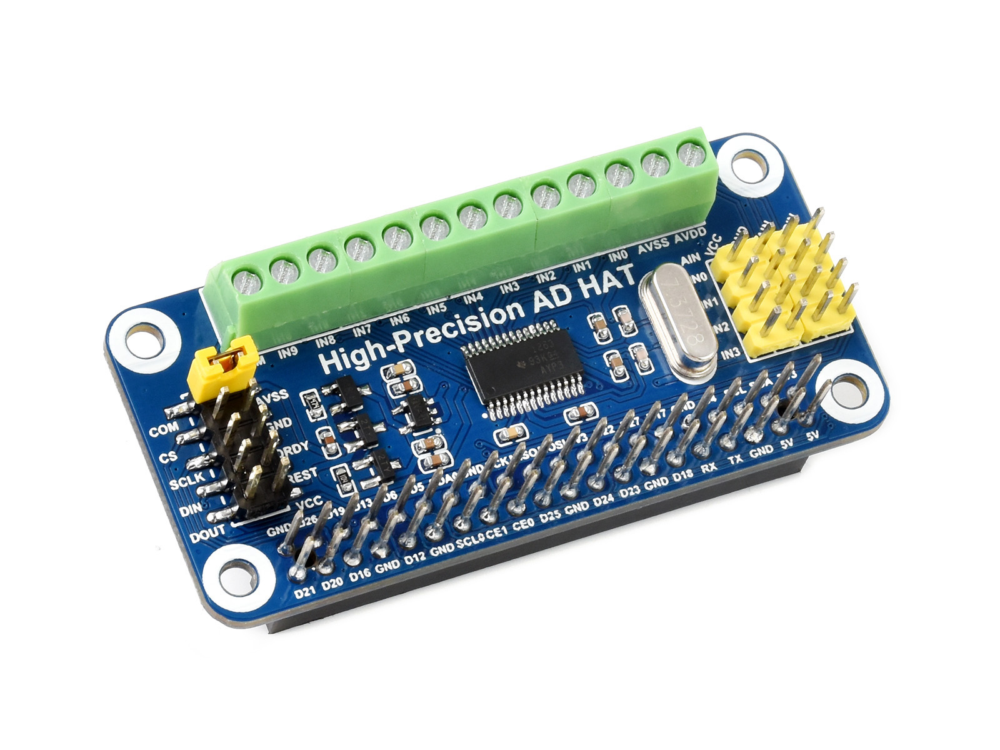

# High-Precision AD HAT
## waveshare electronics

http://www.waveshare.net  
https://www.waveshare.com  

## 中文 ## 
https://www.waveshare.net/shop/High-Precision-AD-HAT.htm
我是块Raspberry Pi扩展板，具备10通道32位高精度ADC和24位辅助ADC。
Raspberry Pi GPIO接口没有AD功能，如果你要用到高精度的ADC，那我将是不错的选择！

## English ## 
https://www.waveshare.com/18983.htm
I am a Raspberry Pi expansion board with an 10-channel 32-bit high-precision ADC and a 24-bit auxiliary ADC.
The Raspberry Pi GPIO interface does not have AD functionality. If you want to use high precision AD, then I will be a good choice!

